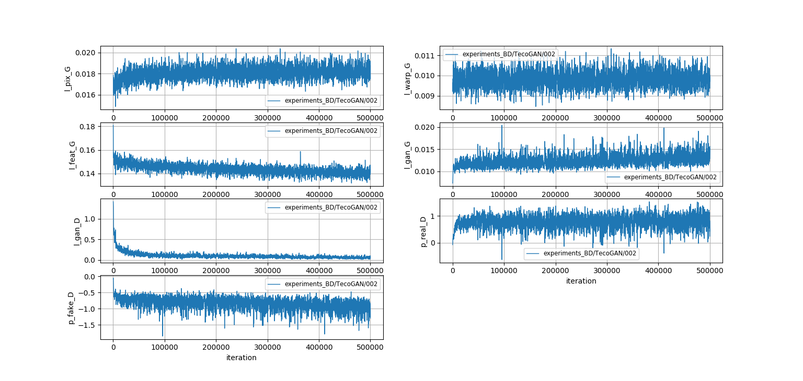
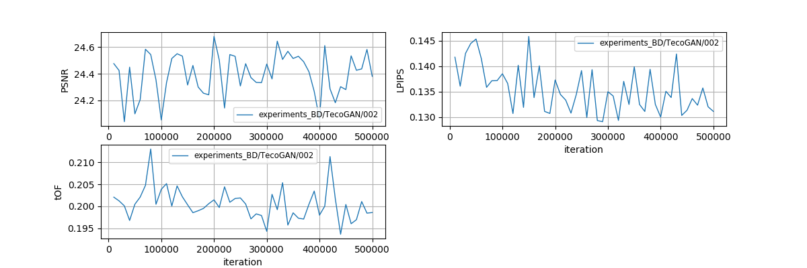

# TecoGAN-PyTorch

### Introduction
This is a PyTorch reimplementation of **TecoGAN**: **Te**mporally **Co**herent **GAN** for Video Super-Resolution (VSR). Please refer to the official TensorFlow implementation [TecoGAN-TensorFlow](https://github.com/thunil/TecoGAN) for more information.

<p align = "center">
    
    
</p>

<p align = "center">
    
    
</p>


### Updates
- 11/2021: Supported 2x SR.
- 10/2021: Supported model training/testing on the [REDS](https://seungjunnah.github.io/Datasets/reds.html) dataset.
- 07/2021: Upgraded codebase to support multi-GPU training & testing.


### Features
- **Better Performance**: This repo provides model with smaller size yet better performance than the official repo. See our [Benchmark](https://github.com/skycrapers/TecoGAN-PyTorch#benchmark).
- **Multiple Degradations**: This repo supports two types of degradation, BI (Matlab's imresize with the option bicubic) & BD (Gaussian Blurring + Down-sampling). <!--Please refer to [this wiki]() for more details about degradation types.-->
- **Unified Framework**: This repo provides a unified framework for distortion-based and perception-based VSR methods.


### Contents
1. [Dependencies](#dependencies)
1. [Testing](#testing)
1. [Training](#training)
1. [Benchmark](#benchmark)
1. [License & Citation](#license--citation)
1. [Acknowledgements](#acknowledgements)


## Dependencies
- Ubuntu >= 16.04
- NVIDIA GPU + CUDA
  - CUDA Toolkit 11.3 is the latest version with which Pytorch is compatible as of June 2022.
  - To see which GPU driver versions are compatible with which CUDA Toolkit version, see [CUDA Compatibility](https://docs.nvidia.com/deploy/cuda-compatibility/index.html).
- Python >= 3.7
- PyTorch >= 1.4.0
- Python packages: See [requirements.txt](requirements.txt)
  - A higher version of pytorch and torchvision may work, but torch==1.7.1 (torchvision==0.8.2 seems compatible) is the lowest version available on pip for Python 3.9 and still only work with CUDA compute capability 3.7 (cards such as GeForce TITAN and TITAN BLACK are 3.5). For a list of which GPUs are compatible with which compute capability, see [CUDA GPUs - Compute Capability](https://developer.nvidia.com/cuda-gpus)
  - To see what compute capability the installed version of torch supports, run: `python -c "import torch; print(torch.cuda.get_arch_list())"`.
- (Optional) Matlab >= R2016b


## Testing

**Note:** We apply different models according to the degradation type. The following steps are for `4xSR` under `BD` degradation. You can switch to `2xSR` or `BI` degradation by replacing all `4x` to `2x` and `BD` to `BI` below.

1. Download the official Vid4 and ToS3 datasets. In `BD` mode, only ground-truth data is needed.
```bash
bash ./scripts/download/download_datasets.sh BD 
```
> You can manually download these datasets from Google Drive, and unzip them under `./data`.
> * Vid4 Dataset [[Ground-Truth](https://drive.google.com/file/d/1T8TuyyOxEUfXzCanH5kvNH2iA8nI06Wj/view?usp=sharing)] [[Low Resolution (BD)](https://drive.google.com/file/d/1-5NFW6fEPUczmRqKHtBVyhn2Wge6j3ma/view?usp=sharing)] [[Low Resolution (BI)](https://drive.google.com/file/d/1Kg0VBgk1r9I1c4f5ZVZ4sbfqtVRYub91/view?usp=sharing)]
> * ToS3 Dataset [[Ground-Truth](https://drive.google.com/file/d/1XoR_NVBR-LbZOA8fXh7d4oPV0M8fRi8a/view?usp=sharing)] [[Low Resolution (BD)](https://drive.google.com/file/d/1rDCe61kR-OykLyCo2Ornd2YgPnul2ffM/view?usp=sharing)] [[Low Resolution (BI)](https://drive.google.com/file/d/1FNuC0jajEjH9ycqDkH4cZQ3_eUqjxzzf/view?usp=sharing)] 

The dataset structure is shown as below.
```tex
data
  ├─ Vid4
    ├─ GT                # Ground-Truth (GT) sequences
      └─ calendar
        └─ ***.png
    ├─ Gaussian4xLR      # Low Resolution (LR) sequences in BD degradation
      └─ calendar
        └─ ***.png
    └─ Bicubic4xLR       # Low Resolution (LR) sequences in BI degradation
      └─ calendar
        └─ ***.png
  └─ ToS3
    ├─ GT
    ├─ Gaussian4xLR
    └─ Bicubic4xLR
```

2. Download our pre-trained TecoGAN model.
```bash
bash ./scripts/download/download_models.sh BD TecoGAN
```
> You can download the model from [[BD-4x-Vimeo](https://drive.google.com/file/d/13FPxKE6q7tuRrfhTE7GB040jBeURBj58/view?usp=sharing)][[BI-4x-Vimeo](https://drive.google.com/file/d/1ie1F7wJcO4mhNWK8nPX7F0LgOoPzCwEu/view?usp=sharing)][[BD-4x-REDS](https://drive.google.com/file/d/1vMvMbv_BvC2G-qCcaOBkNnkMh_gLNe6q/view?usp=sharing)][[BD-2x-REDS](https://drive.google.com/file/d/1XN5D4hjNvitO9Kb3OrYiKGjwNU0b43ZI/view?usp=sharing)], and put it under `./pretrained_models`.

3. Run TecoGAN for 4x SR. The results will be saved in `./results`. You can specify which model and how many gpus to be used in `test.sh`.
```bash
bash ./test.sh BD TecoGAN/TecoGAN_VimeoTecoGAN_4xSR_2GPU
```

4. Evaluate the upsampled results using the official metrics. These codes are borrowed from [TecoGAN-TensorFlow](https://github.com/thunil/TecoGAN), with minor modifications to adapt to the BI degradation.
```bash
python ./codes/official_metrics/evaluate.py -m TecoGAN_4x_BD_Vimeo_iter500K
```

5. Profile model (FLOPs, parameters and speed). You can modify the last argument to specify the size of the LR video.
```bash
bash ./profile.sh BD TecoGAN/TecoGAN_VimeoTecoGAN_4xSR_2GPU 3x134x320
```

## Training
**Note:** Due to the inaccessibility of the VimeoTecoGAN dataset, we recommend using other public datasets, e.g., REDS, for model training. To use REDS as the training dataset, just download it from [here](https://seungjunnah.github.io/Datasets/reds.html) and replace the following `VimeoTecoGAN` to `REDS`.

1. Download the official training dataset according to the instructions in [TecoGAN-TensorFlow](https://github.com/thunil/TecoGAN), rename to `VimeoTecoGAN/Raw`, and place under `./data`.

2. Generate LMDB for GT data to accelerate IO. The LR counterpart will then be generated on the fly during training.
```bash
python ./scripts/create_lmdb.py --dataset VimeoTecoGAN --raw_dir ./data/VimeoTecoGAN/Raw --lmdb_dir ./data/VimeoTecoGAN/GT.lmdb
```

The following shows the dataset structure after finishing the above two steps.
```tex
data
  ├─ VimeoTecoGAN
    ├─ Raw                 # Raw dataset
      ├─ scene_2000
        └─ ***.png
      ├─ scene_2001
        └─ ***.png
      └─ ...
    └─ GT.lmdb             # LMDB dataset
      ├─ data.mdb
      ├─ lock.mdb
      └─ meta_info.pkl     # each key has format: [vid]_[total_frame]x[h]x[w]_[i-th_frame]
```

3. **(Optional, this step is only required for BI degradation)** Manually generate the LR sequences with the Matlab's imresize function, and then create LMDB for them.
```bash
# Generate the raw LR video sequences. Results will be saved at ./data/VimeoTecoGAN/Bicubic4xLR
matlab -nodesktop -nosplash -r "cd ./scripts; generate_lr_bi"

# Create LMDB for the LR video sequences
python ./scripts/create_lmdb.py --dataset VimeoTecoGAN --raw_dir ./data/VimeoTecoGAN/Bicubic4xLR --lmdb_dir ./data/VimeoTecoGAN/Bicubic4xLR.lmdb
```

4. Train a FRVSR model first, which can provide a better initialization for the subsequent TecoGAN training. FRVSR has the same generator as TecoGAN, but without perceptual training (GAN and perceptual losses).
```bash
bash ./train.sh BD FRVSR/FRVSR_VimeoTecoGAN_4xSR_2GPU
```
> You can download and use our pre-trained FRVSR models instead of training from scratch. [[BD-4x-Vimeo](https://drive.google.com/file/d/11kPVS04a3B3k0SD-mKEpY_Q8WL7KrTIA/view?usp=sharing)] [[BI-4x-Vimeo](https://drive.google.com/file/d/1wejMAFwIBde_7sz-H7zwlOCbCvjt3G9L/view?usp=sharing)] [[BD-4x-REDS](https://drive.google.com/file/d/1YyTwBFF6P9xy6b9UBILF4ornCdmWbDLY/view?usp=sharing)][[BD-2x-REDS](https://drive.google.com/file/d/1ibsr3td1rYeKsDc2d-J9-8jFURBFc_ST/view?usp=sharing)]

When the training is complete, set the generator's `load_path` in `experiments_BD/TecoGAN/TecoGAN_VimeoTecoGAN_4xSR_2GPU/train.yml` to the latest checkpoint weight of the FRVSR model.

5. Train a TecoGAN model. You can specify which gpu to be used in `train.sh`. By default, the training is conducted in the background and the output info will be logged in `./experiments_BD/TecoGAN/TecoGAN_VimeoTecoGAN/train/train.log`.
```bash
bash ./train.sh BD TecoGAN/TecoGAN_VimeoTecoGAN_4xSR_2GPU
```

6. Run the following script to monitor the training process and visualize the validation performance.
```bash
python ./scripts/monitor_training.py -dg BD -m TecoGAN/TecoGAN_VimeoTecoGAN_4xSR_2GPU -ds Vid4
```
> Note that the validation results are NOT exactly the same as the testing results mentioned above due to different implementation of the metrics. The differences are caused by croping policy, LPIPS version and some other issues.

<p align = "center">
    
    
</p>


## Benchmark

<p align = "center">
    
</p>

> <sup>[1]</sup> FLOPs & speed are computed on RGB sequence with resolution 134\*320 on a single NVIDIA 1080Ti GPU. \
> <sup>[2]</sup> Both FRVSR & TecoGAN use 10 residual blocks, while TecoGAN+ has 16 residual blocks.


## License & Citation
If you use this code for your research, please cite the following paper and our project.
```tex
@article{tecogan2020,
  title={Learning temporal coherence via self-supervision for GAN-based video generation},
  author={Chu, Mengyu and Xie, You and Mayer, Jonas and Leal-Taix{\'e}, Laura and Thuerey, Nils},
  journal={ACM Transactions on Graphics (TOG)},
  volume={39},
  number={4},
  pages={75--1},
  year={2020},
  publisher={ACM New York, NY, USA}
}
```
```tex
@misc{tecogan_pytorch,
  author={Deng, Jianing and Zhuo, Cheng},
  title={PyTorch Implementation of Temporally Coherent GAN (TecoGAN) for Video Super-Resolution},
  howpublished="\url{https://github.com/skycrapers/TecoGAN-PyTorch}",
  year={2020},
}
```


## Acknowledgements
This code is built on [TecoGAN-TensorFlow](https://github.com/thunil/TecoGAN), [BasicSR](https://github.com/xinntao/BasicSR) and [LPIPS](https://github.com/richzhang/PerceptualSimilarity). We thank the authors for sharing their codes.

If you have any questions, feel free to email me `jn.deng@foxmail.com`
